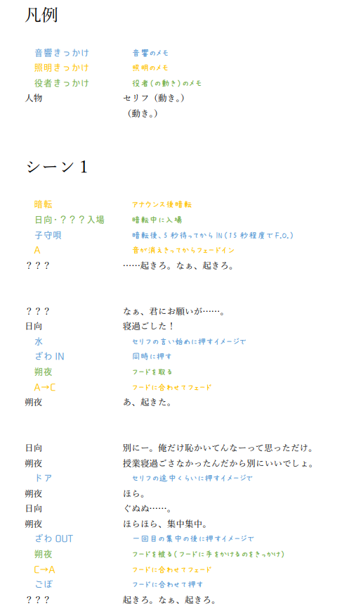

# 音響マニュアル
音響を担当する人向けのマニュアル。

- 順序立ててまとめてあるので通して読んでもOK
- サイドバーのリンクから都度必要なところを参照してもOK

## はじめに

音響担当の役割は、劇に合わせて適切な音を鳴らすこと。
そのための準備として、音源の選定・編集・プラン製作まで行う役職。

#### スケジュール感

期間中の進め方を以下にまとめる。

1. **最序盤：練習が始まったら（脚本・役職が決まったら）**
まずは必要な音を洗い出す。
脚本に書いてあるものだけでなく、他に必要な音がないか脚本・演出に聞いたり、入れるとよさそうな音があれば提案したりする。
この時点でテキストに起こしてまとめておくとよい。

2. **序盤～中盤：必要な音が決まったら**
適切な音源を探す。基本的にはネット上からフリーの音源を拾ってくる形になる。
迷ったら複数の候補を用意して、メンバーに聞いてもらうのがおすすめ。
自分自身とメンバーとで想定しているイメージが異なる場合もあるので、とりあえず聞いてもらってすり合わせるのが重要！
遅くとも期間中盤までには使用音源を確定させたい。
ここで音響プランも書き起こしておく。

3. **中盤～終盤：音源が確定したら（～本番まで）**
実際にシーン練習や通しなどに合わせて、タイミングで音を鳴らす練習を続ける。
実際に合わせている中で改善点が見つかったら、その都度調整を続ける。
やっぱりこの音いらないかも、もしかしたらここにこういう音があったほうが良いかも、と提案をしてみるとよい。

## 環境構築

### ONJO

フリーの音響ソフトとして、ここでは**ONJO**を勧めておく。

#### インストール方法

[ONJOのインストールリンク](https://kanae.net/products/onjo_ja.html)

スクロールして、「ダウンロード」から。基本は64bitの方でOK。
ダウンロードされたZipファイルを「すべて展開」すると、そのフォルダの中にONJO.exeがあるので開く。
※別の場所に置きたい場合、そのフォルダごと移動することを推奨。

#### 操作

[ONJOのインストールリンク](https://kanae.net/products/onjo_ja.html)

こちらをさらにスクロールすると、「利用方法」が記載されているので、そちらを参照。
以下に補足説明を行う。

* **音源の登録**
音源の登録は、公式ではドロップが案内されているが、ここではプロパティからの登録を推奨しておく。
プレイヤー（パネル）のプロパティを開き、「参照」から音源ファイルを選択して追加できる。
なお、該当のプレイヤーに登録していた音源を変更する（差し替える）場合は、一度「クリア」してから再び「参照」するのを推奨。
※「クリア」は音源ファイルの登録を削除するだけ、「全クリア」はボリュームやフェードの設定などもすべて削除される。
登録・変更したら、「更新」か「OK」を押すのを忘れずに。

* **Qファイル（lstファイル）の保存・読込**
上部メニュー「保存」から、登録した音源たちの設定をまとめて保存できる。形式は`.lst`。
後から読み込みたいときは、「開く」から、保存した`.lst`ファイルを選択する。
なお、「保存」しなくてもキャッシュされる（閉じても次回立ち上げ時に戻ってくる）ため、保存し忘れても大丈夫。
とはいえなんらかの事情でキャッシュが消えることもあるので、こまめな保存を推奨。
誰かに共有したいときは、音源ファイル一式が入ったフォルダと、このlstファイルを渡すとよい。

* **手動で音量を変える必要があるとき**
例えば、「タイミングに合わせてゆっくりフェードさせたい」といったときには、プレイヤー左下にあるボリューム調整のバーを直接触って手動で音量を変えるような事が可能。
ただしこの際注意点があり、元々フェードアウトがONになっている音源を手動で音量0にした後、再生停止すると、律儀に元の音量に戻ってからフェードアウトして停止する。そのため、音がもう一度鳴ってしまう。
これを防ぐには、元々フェードアウトをオフにしておくか、手動フェードアウトを行う前に、プレイヤーのフェード切り替えボタンからオフにしておくと良い。

* **「他のプレイヤーの再生を止める」設定に関して**
プレイヤー右から3番目のボタンは、公式によると「再生を開始したとき、他のプレイヤーの再生を止めない/他のプレイヤーの再生を止める」を切り替えるもの。
なのだが、少し重くなったり、任意のタイミングで動かないことがあるので、基本は「止めない」のままにしておくことを推奨。

### その他ソフトに関して（参考）

ONJO以外に用いることのあるソフトについても軽く紹介。

#### Qmix
フリーの音響ソフトとして、Qmixというソフトもある。以前Tipsではこちらが基本的に使われていた。

ONJOがポン出し（その場で再生する音源を都度選択して流す）なのに対し、こちらはQ出し方式。
簡単に言えば、場面ごとに鳴らす音を順番に登録しておき、本番ではそれを次へ次へと進めていく、という形。

BGMが多い場合などはこちらのほうが適していることもある。
しかし、動作が安定しないことが多いため、基本はONJOを使えばよい。
もしもQmixを使いたい場合は、先輩の音響担当に聞くか、Webで調べてみるといい。

#### Spotify、メディアプレーヤーなど

ONJOとは別で音源を鳴らしたいときは、音響向けソフトではない通常の音声再生ソフトを使用することもある。
ONJOとマスターボリュームを分けられる*、プレイリストを作って順に流せばBGMが自動で切り替わる、といった点で便利。
　* Windowsの音量ミキサーでは、ソフト毎に音量を変えられる。そのため、ONJOで流す音とは別で音量を管理したい時に使える

## 音源の準備

### 音源を探す

#### 検索のコツ

- 具体的なワードを入れるべし。
いいものが見つからないなと思ったら、言い換えてみたり、いっそ少し離れたワードにしてみたりするとよい。
- BGMはyoutubeで「〇〇 BGM フリー」「〇〇 フリーBGM」などと検索するか、[DOVA-Syndrome](https://dova-s.jp/)で検索するのがおすすめ。効果音はいろいろなサイトを横断して探すと良い。とりあえずはGoogleで「〇〇 効果音 フリー」と検索。

#### 著作権・利用規約について
著作権・権利表記などに注意すること。配布サイト毎に利用規約が用意されていることが多いので、必ず確認する。
「フリー」という記載がないものは避けておいたほうが無難。
なお、サークル内の劇に用いる場合は商用利用ではない場合が多い。
場合によってはクレジット表記が必要な場合もあるため注意。

#### フリー効果音サイト
フリーの効果音を配布しているサイトでいくつかおすすめがあるので、いくつか紹介。

- [効果音ラボ](https://soundeffect-lab.info/)
種類が結構多い。定番っぽい音質。とりあえずで探しやすい。フリー、クレジット表記不要。

- [無料効果音（効果音で遊ぼう！）](https://taira-komori.net/freesound.html)
こちらも結構な種類。音質がいい（気がする）。フリー、クレジット表記不要。

- [VSQplus](https://vsq.co.jp/plus/)
似たような音のバリエーションが多いのが特徴。少しのニュアンスが…という時にぴったり。フリー、クレジット表記不要。

- [OtoLogic](https://otologic.jp/)
他サイトではあまりない効果音が置いてあることがある。フリー、ただし**__クレジット表記は必要__**。

- [Pixabay](https://pixabay.com/ja/sound-effects/)
グローバルなフリー音源配布サイト。ほとんどタイトルが英語なので、検索に少し癖がある。ただし音源の数はとにかく膨大。フリー、クレジット表記不要。

### 音源を加工する（Audacity）

ダウンロードした音源について、「長さが足りないから自然にループさせたい」「音源自体にフェードをつけたい」「複数の音源を組み合わせたい」といったとき、自分でダウンロードした音源を加工する必要がある。
ここでは、音源加工ソフトとして、フリーソフトのAudacityを勧めておく。人気ソフトであり、Web上での解説も豊富なので、困ったら検索するとよい。

#### Audacityの導入

[Audacityのダウンロードリンク](https://www.audacityteam.org/)

こちらの「Download Audacity ○.○.○」から、インストーラーをダウンロード。
ダウンロードされたインストーラーの.exeファイルを開き、とりあえず`next >`連打。
インストールされたaudacity.exeを開く。

#### Audacityでの編集

- **音源を開く**
左上の「ファイル」→「開く」から、編集したい音源を選択して開く。
もしくは、「ファイル」→「取り込み」→「音源の取り込み」から。

- **カット**
削除したい部分を選択してDelete。

- **トリミング**
残したい部分を選択してコピー（Ctrl+C）またはカット（Ctrl+X）、その後、別の場所やトラックを新規追加してペースト（Ctrl+V）。
もしくは残したい部分以外を選択してDelete。

- **音量調整**
音源全体の音量を調整する場合は、トラック名下のゲイン（+-が書いてあるバー）を調整。
一部を調整する場合は、その部分を選択して「エフェクト」から「増幅」を選択。大きくするなら+、小さくするなら-へ数値を調整して実行。

- **パン振り（左右振り）**
ゲイン下のパン（LPが書いてあるバー）を調整。

- **無音やノイズの挿入**
挿入したい部分に再生カーソルを合わせた後、「ジェネレーター」から、挿入したいものを選択して、生成したい秒数を選択。

- **フェードアウト・フェードイン**
フェードさせたい部分を選択した後、「エフェクト」から「フェードイン」／「フェードアウト」を選択。程度や秒数を調整して実行。

- **速度調整**
速度を変更したい部分を選択した後、「エフェクト」から「変更：テンポの調整」を選択。

- **複数音源の結合**
複数音源を開いて、1つ目の音源から結合したい部分を選択してコピーし、2つ目の音源の挿入したい部分にペースト。
自然につなげたいときは、それぞれにフェードをかけて、簡易的なクロスフェードにするとよい。

- **保存と書き出し**
「ファイル」→「保存」で保存されるのはAudacityでの編集データであり、音源ではない、という点に注意。編集データも保存することを推奨。あとから追加の編集などが必要になる場合がある。
加工した音源を保存したい場合は、「ファイル」→「書き出し」から「mp3として書き出し」を選択。タグなどはお好みで。あとは保存先を選択、ファイル名を入力して完了。

### 録音について

セリフを音として流したいなど、録音した音源を使いたい、という場合がある。
その際はスマホの録音機能を使うとよい（iPhoneならボイスメモ）。
録音したものをPCに取り込み、変換サービスなどを利用して`.mp3`ファイルに変換したものを音源として利用する。
※iPhoneのボイスメモだと形式がm4aになっており、AudacityやONJOでは扱えない・不安定なので、mp3に変換することを推奨。

変換にはWeb上の変換サービスを使うことが多い。
参考までに、変換サービスの1つを紹介→　[Convertio](https://convertio.co/ja/)
ファイルを選択し、変換したい形式を選択するだけで完了する。ただし一度に変換できる数に制限あり。

### 音源の管理

公演ごとにフォルダを用意して、その中に更に音源用のフォルダを用意するのを推奨。
実際にONJOに登録する音源だけを残して、加工元や不使用になった音源はフォルダを分けておくとよい。

## 音響プランの作り方

### 音の洗い出し

まずは脚本に書いてある音をまとめる。そのうえで、書いてはないが必要そうな音があればそれもまとめる。
まとめたら、早めに脚本・演出へ確認を取る。より具体的に、こういうイメージの音でいいか、のように伝えられるとなおよし。
もしそこで追加の要望があれば対応。

### プランのまとめ方

やりやすいように、自分が本番で見やすいようにまとめるとよい。
大まかには、Qシート（音を鳴らす前後だけセリフなどを抜き出したり、タイミングを詳しく書いたりする）を1から作る場合と、台本内に直接書き込む場合に分けられる。操作が煩雑な場合（音響操作が多い、操作が密集しているなど）はQシートを作成することを推奨。
プランをメンバーと共有する場合も多いので、できる限り見るだけで、どのタイミングで何をやるのか、が分かりやすいものにするとよい。

### Qシートの書き方
Qシートは、「どのシーンか」「どのセリフ・動きの前後か」「どの音が鳴るのか」が分かるように書く。

ここでは、参考程度に一例として、実際に使用したQシートをもとに説明する。

音響操作がある前後のセリフ・動きをいくつか抜き出し、そこに音響操作を記載。
音響操作は、照明操作と連動することも多いため、簡易的にでもいいので照明操作も記載しておくとよい。
この際、セリフ、音響操作、照明操作、役者の動き、と、それぞれで色分けをしておくとわかりやすい。
また、ONJOに登録する音源のファイル名（プレイヤーに表示される音源名）と、Qシートの記載を合わせておくとなおよい。

## 場当たり・ゲネ・当日のオペレーション

### 機器接続

基本的には、自分のPCと会場の音響機器をHDMIケーブルで接続して使うことが多い。
会場によって、機器側で音量調整ができる場合があるため、音量に注意。
特に複数チームで公演する場合、自分の番の前に調整しておくこと。
ゲネや場当たりなどで確認した音量を記録しておくのを忘れずに。

接続する前に一度音響ソフトは落としておき、接続後にソフトを起動すると安全。
念のため、音声出力先が変更されているか（機器側が選択されているか）を確認しておく。
タスクバー右下のスピーカーのマークから、右下の「サウンド出力の選択」を開くと確認できる。
抜くときはそのまま抜いてOK。

### 本番前の準備
不要なソフトが開かれたままだとPCが重くなり、音響ソフトの動作が不安定になることがあるので、閉じておく。
また、音響ソフト以外は音声出力をミュートしておく（先程の「サウンド出力の選択」からスクロールし、「音量ミキサー」から。）。
特にDiscordの通知音、システム音（エラー音などが鳴る場合がある）に注意。

### 開場BGM

<a href="BGM_open.mp3" download>開場BGM</a>
　↑クリックでダウンロード

開場～開演の間の約30分間、上記のBGMを流す。
使用ソフトはメディアプレーヤーがおすすめ。
複数チーム公演の場合、1番目のチームの音響が担当。

多くの場合、開演前にはアナウンスが入る。

- アナウンス前に音量を下げ、アナウンス後に再び上げ、開演に合わせて切る
- アナウンス前に切る

どちらかのパターンを取ることが多い。公演のアナウンス担当（サークル長の場合が多い）に要確認。

### 音出し時の注意点
場当たりやゲネにて、音量調整などで音を実際に鳴らす場合、急に音が鳴るとびっくりさせてしまうことがあるので、必ず「音が鳴ります！」などの声掛けを行う。
また、いきなり大きな音が鳴るとスピーカーなどにも負担がかかるので、初めは小さめの音量からはじめ、少しずつ大きくしていく方向で進めるとよい。

### Tips
ONJOに「無音」を登録しておき、本番中や音を鳴らす前後は常に再生しておくとよい。
ONJOが音声出力を行っていない状態からいきなり音を鳴らすと、システム側が音声出力を認識するまでにラグが生じ、短い音はそもそも鳴らないことがある。無音を常時再生しておくことで、これを防げる。

### トラブルシューティング

- **（場当たり・ゲネの準備で）そもそも何も音が鳴らない**
まず、正常に接続されているかを確認。「サウンド出力の選択」で、実際に音響機器側が選択されているかをチェック。そもそも1つしか表示されていない場合は接続できていないので、ケーブルを確認したり、接続し直したりするとよい。
正常に接続されているのに鳴らない場合は、「音量ミキサー」を開いて、ミュートになっていたり音量が小さすぎたりしないかを確認。
それでもダメな場合は、ONJOを再起動。それでもダメなら、PCを再起動。他のPCでも鳴らない場合、会場側の問題の可能性も0ではないので頭に入れておくこと。

- **（本番中に）1つ音が鳴らせなかった！　鳴らす音を間違えた！**
仕方ないので、気にせず次の操作に備える。焦らない。
ただし、役者が音を待っているような場合であれば、様子を見て鳴らしてみる。

## 補足：映像を兼任する場合

音声入力と映像入力が同じHDMI接続になる場合、音響が映像（プロジェクターになにか投影する）を兼任して担当することがある。

ここでは、その際に使えるソフトを軽く紹介する。

#### PowerPoint

説明不要のMicrosoftOffice。
スライドに画像や動画を貼り付けて、本番ではスライドショーを投影する形。
ONJOと同時に利用する場合は、スライドの切り替えに2クリック必要（ウィンドウを選択するのに1クリック消費されるため）な点に注意。また、発表者ツールは全画面表示を解除し、小さめのウィンドウで表示することも可能。
動画の場合、再生バーが見えてしまう場合があること、動画が流れている裏でONJOを触ると動画が停止してしまうことにも注意。

#### OBSstudio

本来は配信・録画用ソフト。
こちらの「シーン」機能を上手く応用すると、画像・動画をフェード・カットで切り替えるなど、簡易的にスライドショーのようなことができる。
利点として、動画でも再生バーが表示されない、ONJOを触っても動画が停止しない、操作画面が小さい、などがある。
ただし少し操作や設定が難しいので、基本はPowerPointでよい。
